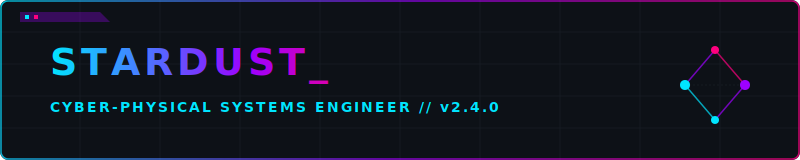

<div align="center">
  
  
  <h3>🚀 AI-Powered Enterprise Security Auditing for Modern Codebases</h3>
  <p>Identify deep logic flaws, enforce compliance, and secure your repositories using Multi-Agent RAG.</p>
</div>

---

## 💡 The Problem

Modern software development moves fast, and traditional Static Application Security Testing (SAST) tools can't keep up. Legacy scanners rely heavily on rigid regular expressions and pattern matching, which leads to two massive problems:
1. **High False Positives**: Flooding developers with useless alerts.
2. **Context Blindness**: They check files *independently*, entirely missing business logic flaws, authorization bypasses, and complex attack chains that span multiple files.

For startups, hackathon teams, and fast-moving enterprises, hiring dedicated security engineers to manually review every PR is too expensive and too slow.

---

## 🎯 Our Solution: SentinelAI

SentinelAI is a next-generation security auditor that bridges the gap between traditional scanning and human-level security review. 

By combining **Large Language Models (Gemini)** with **Retrieval-Augmented Generation (ChromaDB)**, SentinelAI doesn't just read your code line-by-line—it *understands* your entire repository's architecture. It maps out your authentication flows, database interactions, and API routes, simulating real-world attack paths to find deep contextual vulnerabilities that pattern-matchers miss.

<div align="center">
  
</div>

## ✨ Key Features

* 🧠 **Context-Aware AI Analysis**: Uses Gemini and local RAG (ChromaDB) to understand how files interact, finding logic flaws regular scanners miss.
* 🖥️ **Dual Interfaces**: Choose between our hacker-style **Terminal UI (TUI)** or our beautiful, glassmorphism **Web Dashboard (Mission Control)**.
* 📜 **Native Compliance Engines**: Automatically checks your codebase against enterprise frameworks including **OWASP Top 10, HIPAA, GDPR, PCI-DSS, SOC2, and CWE**.
* 📦 **Automated SBOMs**: Generates CycloneDX Software Bill of Materials instantly.
* 🛠️ **1-Click Remediation**: Not only finds bugs but generates `.patch` files to automatically fix them.
* 💬 **Interactive Code Chat**: Chat directly with your codebase's security context after an audit to ask follow-up questions.
* 📊 **History & Trends**: Local SQLite database tracks your audit history, letting you see your security posture improve over time.
* 🤖 **CI/CD Pipeline Ready**: Headless mode outputs structured JSON and returns severity-based exit codes for GitHub Actions/GitLab CI.
* 📑 **Rich Exporting**: Export professional, styled reports to HTML or PDF for stakeholders.

---

## 🏗️ Technical Architecture

<div align="center">
  
</div>

SentinelAI operates through a robust 6-phase pipeline:
1. **Target Resolution**: Seamlessly clones remote GitHub repos or analyzes local folders.
2. **Pre-Scan (Gitleaks)**: High-speed traditional scanning for hardcoded secrets and API keys.
3. **RAG Vectorization**: Chunks source files, generates summaries, and builds a searchable semantic index in **ChromaDB**.
4. **Multi-Agent Analysis**: Analyzes dependencies, hunts for architecture weaknesses, and cross-references against compliance profiles.
5. **Report Generation**: Synthesizes findings, builds mitigation steps, and assigns accurate severity scores.
6. **Serving**: Streams real-time results via WebSockets (FastAPI) to the Frontend or renders them in the Textual TUI.

---

## 🚀 Installation

We've built a frictionless, one-click installer for Windows environments. It automatically installs Python, Git, Gitleaks, creates an isolated virtual environment, installs all dependencies, and adds `sentinelai` to your System PATH.

1. Clone the repository:
   ```bash
   git clone https://github.com/StarDust-Git-Code/sential.ai.git
   cd sential.ai
   ```
2. Open **PowerShell as Administrator** and run the setup script:
   ```powershell
   powershell -ExecutionPolicy Bypass -File install.ps1
   ```
3. Open a **new** terminal window—you're ready to go!

---

## 💻 Usage

SentinelAI is incredibly versatile. You can use our full-screen interfaces or run quick headless commands.

### 🎮 The Interfaces

```bash
# Launch the Terminal UI (TUI)
sentinelai

# Launch the Web UI Dashboard in your browser (localhost:8765)
sentinelai --web
```

### 🛠️ CLI Power User Commands

```bash
# Basic security audit of the current directory
sentinelai audit .

# Audit with Compliance checks and SBOM generation
sentinelai audit . --compliance owasp --sbom

# Auto-generate Git patches for fixable vulnerabilities
sentinelai audit . --fix

# CI/CD Mode (outputs JSON and exits with error code if critical vulns found)
sentinelai audit . --ci

# Interactive mode (drop into chat after the audit completes)
sentinelai audit . --interactive

# Export the final report to HTML
sentinelai audit . --export html

# View your historical audits and vulnerability trends
sentinelai history
```

---

## 🔑 API Keys

SentinelAI requires a **Gemini API Key** to power its reasoning engine. 
* **Privacy First**: Your keys and source code are stored **locally**. Code is only sent securely to the LLM provider for analysis and is never stored on our servers.
* **Setup**: You can add your key via the "Settings" menu in the Web UI, paste it when prompted in the TUI, or pass it via the CLI `--keys` flag.

---

<div align="center">
  <b>Built for Hackers, By Hackers.</b> <br/>
  <i>Enterprise-grade security insights without the enterprise price tag.</i>
</div>
